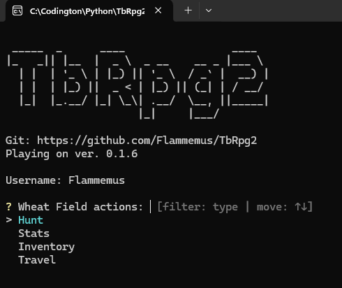
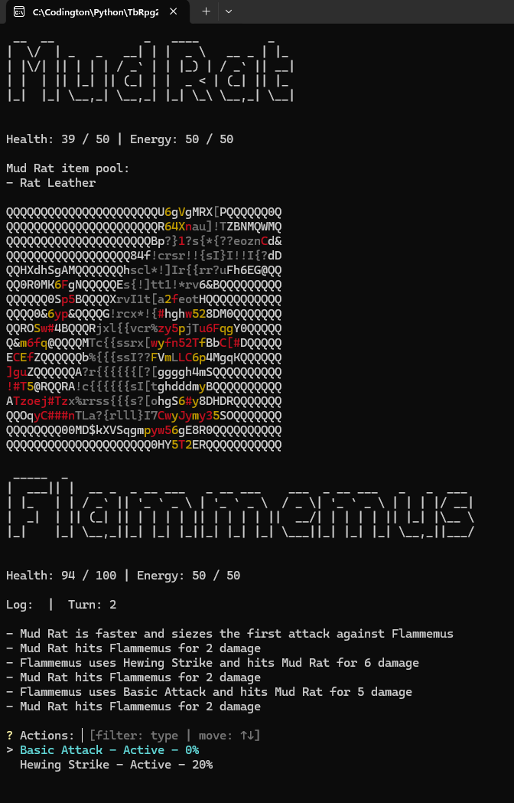
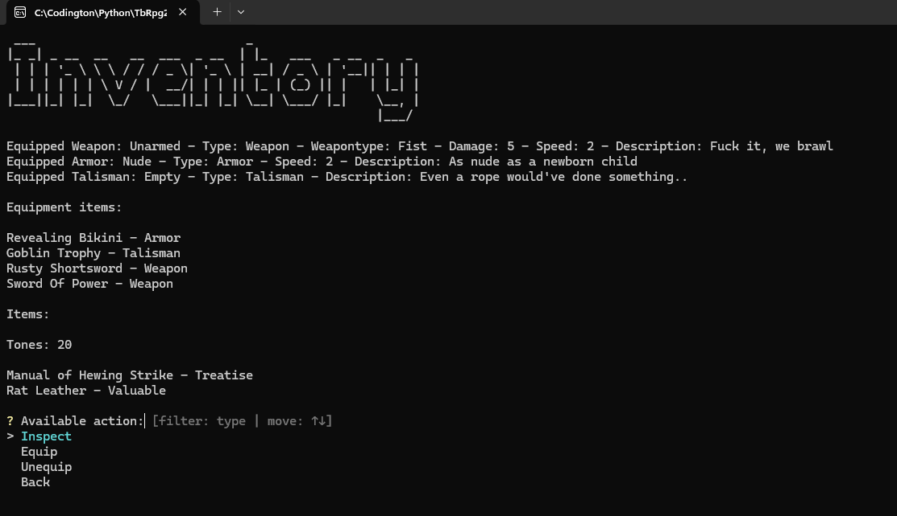

<h1>TbRpg2 (placeholder name)</h1>

<em>To download the game click the green "<>Code" button located above the project files, then at the bottom of the dropdown, click Download ZIP.

To run the game, find and run the "TbRpg2.exe" file located in the "dist" folder.</em>

A text based RPG (2) game that is inspired by the games: Stoneshard and Deepwoken, the books The Name of the Wind and The Blacktongue Thief.

The idea is a RPG world where you play as a mercenary (?) that takes on jobs for tones, the worlds currency. There is no leveling system, all progress and stats are dependant on tones and exploration. With tones you can buy better gear and treatises to learn powerful abilities.

## Game Screenshots

## Future plans:
<li>Saving system with accounts (Firebase?)</li>
<li>Shop system dependant on town reputation</li>
<li>Oath system which grants unique abilities</li>
<li>Dungeon system, exclusive gear</li>
